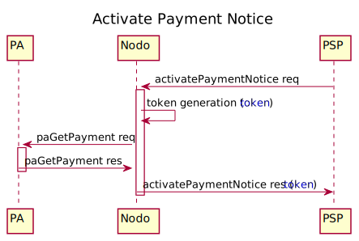
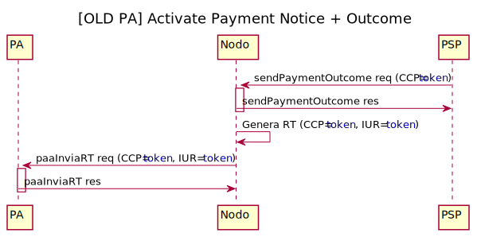

<!-- 
plantuml -tsvg api-definitions/openapi/descriptionPA.md 
-->
# Introduction

This is the documentation of the pagoPA API for Public Administration. This API enables a PA  to request a payment on pagoPA Payment Notice according to _CAD (Codice Amministrazione Digitale)_

The payment process defined below starting from the infrastructures made available by the PSP such as, for example, ATMs, Home banking and mobile payment applications, post offices, etc. The acquisition of the information necessary to communicate with the platform is contained within a `QR-CODE` present in the payment notice which can facilitate data entry. The same information is present in the notice to allow manual entry

### API NodoSPC payment : **PSP side**
_Reference API PSP side is available [here](https://pagopa.github.io/pagopa-api/index.html)_

### Payment process activated by the PSP

<!-- 
@startuml uml_diag/seqdiag-wisplightnuovoModello3_newPA
title Payment process activated by the PSP

participant PA
participant Nodo
participant PSP
actor       User

== verify phase ==
User [#blue]-> PSP: Payment Notice
PSP -> Nodo: verifyPaymentNotice req
note right : The PSP requests the verification of the notice \n (check amount)
Nodo -> PA: paVerifyPaymentNotice req
note left #aqua : Debt Position\n STATUS = **Open**
activate PA
PA -> Nodo: paVerifyPaymentNotice res
deactivate PA
Nodo -> PSP: verifyPaymentNotice res
deactivate Nodo
PSP [#blue]-> User: Notice verified and updated

== activate phase ==
User [#blue]-> PSP: Confirm willingness to pay
PSP -> Nodo: activatePaymentNotice req
note right : The PSP requires payment activation
activate Nodo
Nodo -> Nodo: Token generation
Nodo -> PA: paGetPayment req (CCP=token)
note left #aqua : Debt Position\n STATUS = **Open**
activate PA
PA -> Nodo: paGetPayment res
deactivate PA
Nodo -> PSP: activatePaymentNotice res
note right : The PSP has all data \nto allow the payment
deactivate Nodo

PSP [#blue]-> User: Payment page
note left PA #pink : Newly configured PAs \n**DOES'NT HAVE TO** lock the debt position \nafter activation.

== send receipt phase (push) ==

User [#blue]-> PSP: Pay
note right PSP : If payment OK ->  RT +\nIf payment KO -> RT -

PSP -> Nodo: sendPaymentOutcome req
activate Nodo
Nodo -> PSP: sendPaymentOutcome res
deactivate Nodo
Nodo -> Nodo: RT generation
Nodo -> PA: paSendRT req
activate PA
PA -> Nodo: paSendRT res
deactivate PA
note left #aqua : Debt Position\n STATUS = **Open -> Closed/Open**\n(based on RT result)

@enduml
-->

**Please notice: this API is subject to small changes since it is in final test release**

## Identification and Authentication

Use of this API is restricted to PA, or 3rd parties ( named as brokers ) which have signed a contract with [PagoPA S.p.A.](https://www.pagopa.gov.it/it/pagopa-spa/) as stated _[here](https://www.pagopa.gov.it/it/pubbliche-amministrazioni/come-aderire/)_

Both PAs and Brokers are identified with an identifier (`idPA`, `idBrokerPA`)  assigned by PagoPA S.p.A.

Formally, any API request is coming from a broker on behalf of a PA which is responsable of the payment.
  
| Field   |      Description      |  Example value |
|:----------:|-------------|------|
| **idPA** | Alphanumeric field containing the tax code of the PA that manage the payment request. (_in previous versions called_ `identificativoDominio`)| 80215430580 |
| **idBrokerPA** | Identification of the PA intermediary who provides the specific access (**idStation**) | 88835020584 |
| **idStation**|  Station identifer related to PA in the SPC Payment Node system | 888020584_01 |

## Verify Phase
Below is the detailed diagram of this phase
<!-- 
@startuml uml_diag/verifyPaymentNotice_newPA
title Verify Payment Notice

participant PA
participant Nodo
participant PSP

PSP -> Nodo: verifyPaymentNotice req
activate Nodo
Nodo -> PA: paVerifyPaymentNotice req
activate PA
PA -> Nodo: paVerifyPaymentNotice res
deactivate PA
Nodo -> PSP: verifyPaymentNotice res
deactivate Nodo

@enduml
-->

## Activation Phase
Below is the detailed diagram of this phase

<!-- 
@startuml uml_diag/activatePaymentNotice_newPA
title Activate Payment Notice

participant PA
participant Nodo
participant PSP

PSP -> Nodo: activatePaymentNotice req
activate Nodo
Nodo -> Nodo: token generation (<color blue>token</color>)
Nodo -> PA: paGetPayment req
activate PA
PA -> Nodo: paGetPayment res
deactivate PA
Nodo -> PSP: activatePaymentNotice res (<color blue>token</color>)
deactivate Nodo

@enduml
-->

## Receipt Phase
Below is the detailed diagram of this phase

<!-- 
@startuml uml_diag/outcomeOK
title Outcome

participant PA
participant Nodo
participant PSP

PSP -> Nodo: sendPaymentOutcome req
activate Nodo
Nodo -> PSP: sendPaymentOutcome res
deactivate Nodo
Nodo -> Nodo: RT generation
Nodo -> PA: paSendRT req
activate PA
PA -> Nodo: paSendRT res
deactivate PA

@enduml
-->

